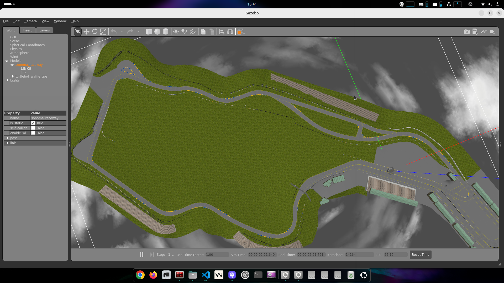

# Nav2 GPS Waypoint Following - ROS2 Humble




This is a modified version of the tutorial code found referenced in the [official Nav2 tutorials](https://docs.nav2.org/tutorials/docs/navigation2_with_gps.html),which is hosted [here](https://github.com/ros-navigation/navigation2_tutorials/tree/master/nav2_gps_waypoint_follower_demo)

The code is modified to work with ROS2 Humble, applying the changes mentioned in this [GitHub Issues thread](https://github.com/ros-navigation/navigation2_tutorials/issues/77)

## Running the code

Step 1: Pull the docker image from sky's docker hub, which contains all the necessary dependencies:
```bash
docker pull everskyrube/navis-ros2-humble:latest
```

Step 2: Configure the docker-compose file from this repository `./docker/docker-compose.yml`

Step 3: Run the docker container with bash script there
```bash
./run.sh
```

Next make the following change to the file found at `/opt/ros/humble/lib/python3.10/site-packages/nav2_simple_commander/robot_navigator.py`, per this [issue thread](https://github.com/cra-ros-pkg/robot_localization/issues/844):

Existing code:
```
    def waitUntilNav2Active(self, navigator='bt_navigator', localizer='amcl'):
        """Block until the full navigation system is up and running."""
        self._waitForNodeToActivate(localizer)
        if localizer == 'amcl':
            self._waitForInitialPose()
        self._waitForNodeToActivate(navigator)
        self.info('Nav2 is ready for use!')
        return
```
Replace with:

```
    def waitUntilNav2Active(self, navigator='bt_navigator', localizer='amcl'):
        """Block until the full navigation system is up and running."""
        if localizer != "robot_localization":
            self._waitForNodeToActivate(localizer)
        if localizer == 'amcl':
            self._waitForInitialPose()
        self._waitForNodeToActivate(navigator)
        self.info('Nav2 is ready for use!')
        return
```

#### Waypoint Navigation Demo

Per the tutorial, first run:

`ros2 launch nav2_gps_waypoint_follower_demo gps_waypoint_follower.launch.py use_rviz:=True`

Alternatively,

```bash
./launch.sh
```
or use mapviz:

```bash
./launch_mapviz.sh
```

Then, on a separate terminal

`ros2 run nav2_gps_waypoint_follower_demo logged_waypoint_follower </path/to/yaml/file.yaml>`

If the path is empty, the default waypoints found in `config/demo_waypoints.yaml` will be used

namely,

```bash
./launch_demo.sh
```
